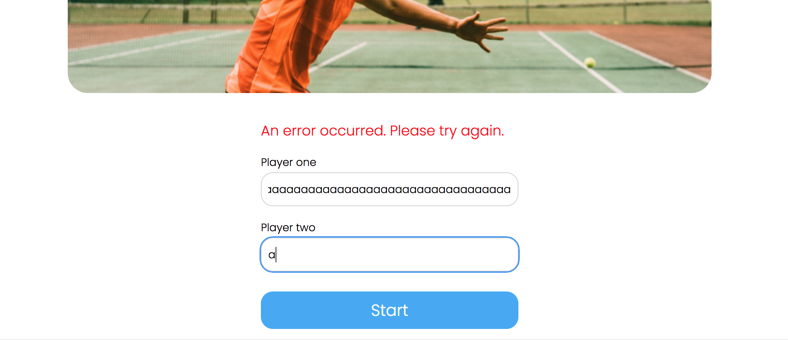
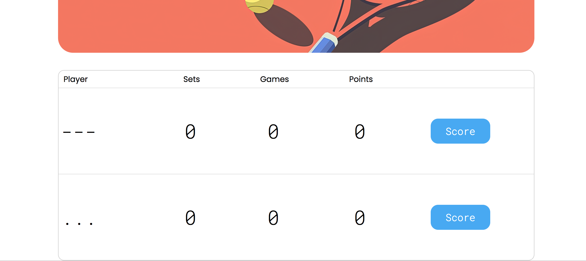
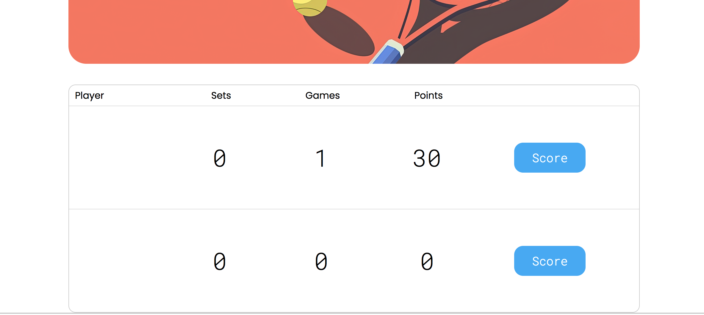
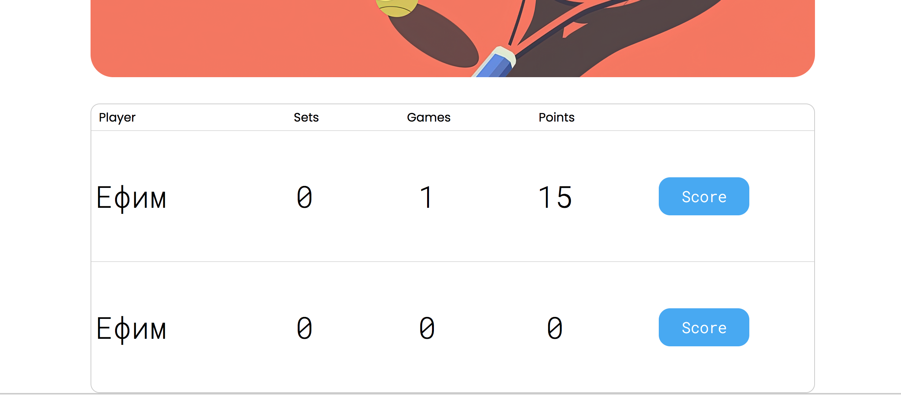
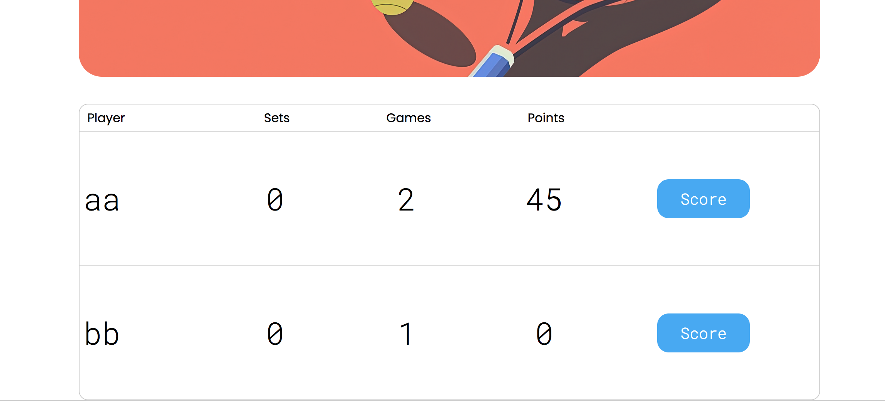
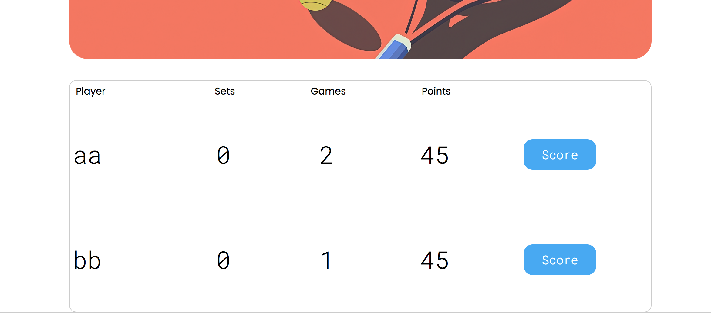
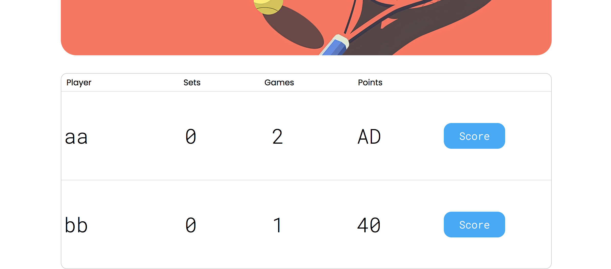

```text
Знаком ❗️ помечены критически важные замечания, а также места нарушения ТЗ.
```

## Функциональный обзор

- Неинформативное сообщение об ошибке:



Лучше при вводе неподходящего имени ясно сообщать пользователю, что именно не так.

- Сейчас можно создать игроков с такими именами:



И даже с пустыми именами



Стоит добавить хотя бы минимальную валидацию.

- ❗️Можно создать игроков с одинаковыми именами:



Тогда визуально очки всегда будут начисляться первому игроку.

- ❗️После 30 счёт должен становиться 40, а не 45. Сейчас так:



А при переходе режим преимущества счёт меняется с такого:



На такой:



