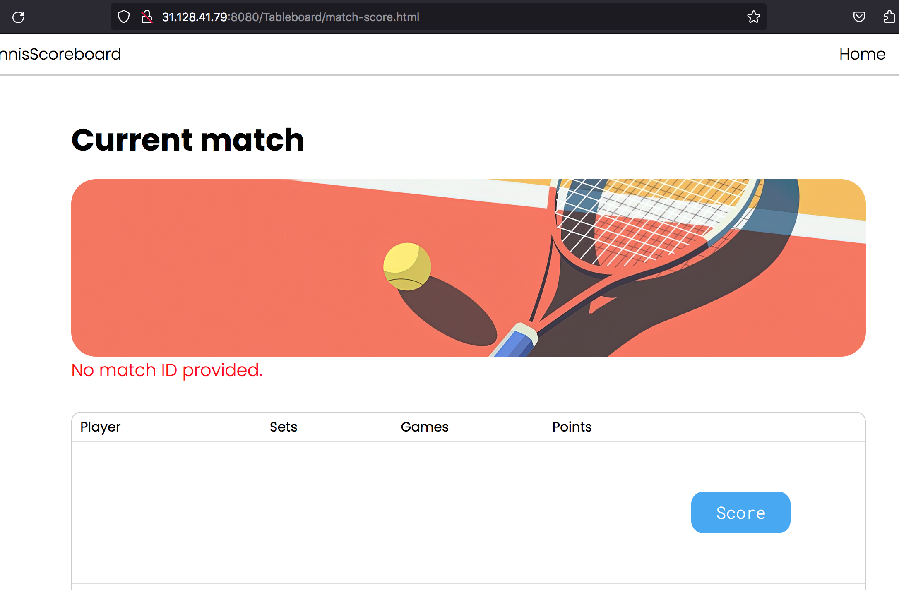

# Сводный отчёт по код-ревью проекта `tennis-scoreboard`

# Review на реализацию от [@M_K_N_05](https://github.com/Ikigai-del/Tableboard) проекта [Табло теннисного матча](https://zhukovsd.github.io/java-backend-learning-course/projects/tennis-scoreboard/)

> Ревью выполнено в формате fork-а репозитория и добавления комментариев 'In-Situ' и обучающих заметок в формате markdown.

К классам и файлам конфигурации добавлены подробные комментарии. 

Там же есть ссылки на файлы, объясняющие некоторые особо значимые темы. 

Сами файлы с заметками находятся в одном пакете с классами, к которым относится тема заметки.

```
В `TODO`-комментариях️ описаны критически важные замечания, а также места нарушения ТЗ.
```

Список всех `TODO`-комментариев сгруппированных по пакетам и классам можно посмотреть в Idea через меню: `View` -> `Tool Windows` -> `TODO`

Читать стоит в таком порядке:

1. В файле `1-functional-overview.md` описан функциональный обзор приложения.

2. В файле `2-refactoring-roadmap.md` находится план работы над исправлениями.

- В файле `Common.md` описаны замечания, относящиеся ко всему проекту или нескольким его частям. (можно читать в любое время)

- В файле `Pluses.md` описаны наиболее значимые плюсы. (можно читать в любое время)

- В файле `Conclusion.md` находится заключение. (можно читать в любое время)

```text
Знаком ❗️ помечены критически важные замечания, а также места нарушения ТЗ.
```

## Функциональный обзор

- Неинформативное сообщение об ошибке:


Лучше при вводе неподходящего имени ясно сообщать пользователю, что именно не так.

- Сейчас можно создать игроков с такими именами:


И даже с пустыми именами


Стоит добавить хотя бы минимальную валидацию.

- ❗️Можно создать игроков с одинаковыми именами:


Тогда визуально очки всегда будут начисляться первому игроку.

- ❗️После 30 счёт должен становиться 40, а не 45. Сейчас так:


А при переходе режим преимущества счёт меняется с такого:


На такой:


## Конфигурационные файлы

### pom.xml

Файл конфигурации удобнее читать, когда зависимости в нём расположены в порядке важности для проекта.
```xml
    <!-- Файл конфигурации удобнее читать, когда зависимости в нём расположены в порядке важности для проекта -->
    <dependencies>
```
***

### hibernate.cfg.xml

Как и из кода, комментарии из файлов конфигурации стоит удалять перед коммитом.
```xml
<!-- Как и из кода, комментарии из файлов конфигурации стоит удалять перед коммитом. -->
<hibernate-configuration>
```
***

Данные об имени пользователя и пароле не должны попадать в github.
```xml
        <!-- ! Данные об имени пользователя и пароле не должны попадать в github -->
        <property name="hibernate.connection.username">
```
***

## org.example.controller

### Архитектурный анти-паттерн: "Толстый контроллер" (Fat Controller)

"Толстый контроллер" — это распространенный анти-паттерн в приложениях, построенных на архитектуре MVC (Model-View-Controller). Он возникает, когда слой контроллеров берет на себя слишком много ответственности. Вместо того чтобы быть тонким связующим звеном, он разрастается и вбирает в себя логику, которая должна находиться в других слоях приложения.

#### Как должно быть

В идеальной архитектуре **"Худые контроллеры, толстые модели" (Thin Controllers, Fat Models)**, обязанности строго разделены:

| Слой  | Обязанности |
|:---|:---|
| **Худой Контроллер** (Thin Controller) | - Принять HTTP-запрос и разобрать его параметры.<br>- Вызвать **один** метод в сервисном слое (модели), передав ему эти данные.<br>- Получить от сервиса результат. <br>- Выбрать подходящее представление (View) и передать ему результат для отображения. |
| **Толстая Модель (Сервисный слой)** (Fat Model) | - Бизнес-логика: Сложные вычисления, принятие решений, изменение состояния бизнес-сущностей.<br>- Логика доступа к данным: Прямые запросы к базе данных (например, через DAO или EntityManager).<br>- Оркестрация: Координация работы нескольких сервисов для выполнения одной бизнес-операции.<br>- Управление транзакциями.|

При таком подходе бизнес-логика становится независимой от веб-слоя, легко тестируется и может быть переиспользована где угодно.

"Толстый контроллер" нарушает это разделение. Он начинает содержать в себе бизнес-логику, логику доступа к данным, оркестрацию нескольких сервисов и даже форматирование данных.

#### Последствия "Толстого контроллера"

1. Нарушение Принципа единственной ответственности (SRP): Контроллер начинает делать всё сразу, что делает код запутанным и сложным для понимания.

2. **Низкая тестируемость:** Бизнес-логику внутри контроллера практически невозможно протестировать в изоляции от веб-контекста.

3. **Плохая переиспользуемость:** Логика, "запертая" в контроллере, не может быть повторно использована в других частях системы (например, в фоновых задачах или для мобильного API).

4. **Дублирование кода (нарушение DRY):** Если похожая бизнес-операция понадобится в другом контроллере, высока вероятность, что разработчик просто скопирует кусок кода, вместо того чтобы вынести его в общий сервис.

5. **Сложность в поддержке:** Код становится запутанным, а его обязанности — размытыми, что усложняет отладку и внесение изменений.

#### Решение

Решение заключается в рефакторинге: необходимо переносить всю бизнес-логику и логику оркестрации из контроллеров в соответствующий **сервисный слой**. Контроллер должен оставаться "худым" — его единственная задача быть посредником между миром HTTP и приложением.

### Принцип разделения ответственности (Separation of Concerns) в архитектуре MVC(S)

## Введение

Любое программное приложение со временем усложняется. Чтобы сохранить возможность развивать и поддерживать его, в разработке используют принцип **разделения ответственности (Separation of Concerns, SoC)**. Суть его такая: каждый модуль или слой системы должен отвечать за одну чётко определённую задачу. Это улучшает читаемость кода, упрощает тестирование, позволяет заменять отдельные части без влияния на остальные.

## Общая архитектура MVC(S)

MVC (Model-View-Controller) – архитектурный паттерн для разделения данных приложения и управляющей логики на три отдельных компонента: модель, представление и контроллер. В веб-приложениях его часто расширяют до **MVC(S)**, где отдельно выделяют слой **Service** (бизнес-логика).

- **View (Представление)** – то, что видит пользователь (JSP-страницы).
- **Controller (Контроллер)** – сервлеты, которые принимают HTTP-запросы, вызывают нужные сервисы и передают данные в представление.
- **Model (Модель)** – данные и логика их обработки. В текущем проекте модель состоит из нескольких подуровней:
    - **Domain Model (Доменная модель)** – объекты, отражающие бизнес-сущности и правила.
    - **Service (Сервис)** – слой, содержащий бизнес-логику и координирующий работу с данными.
    - **DAO (Data Access Object)** – объекты доступа к данным, работающие с JPA-сущностями.
    - **JPA-Entity** – сущности, привязанные к таблицам базы данных через JPA-аннотации.
    - **DTO (Data Transfer Object)** – объекты для передачи данных между слоями (например, между сервисом и контроллером).

Такое расслоение позволяет чётко разграничить зоны ответственности каждого компонента.

## Детальный разбор слоёв

### 1. JSP (View)

JSP отвечает только за **отображение данных**, полученных от контроллера, и за формирование HTML-форм для отправки данных на сервер. JSP не должна содержать бизнес-логики, обращений к базе данных или прямых вызовов сервисов. Все необходимые для рендеринга данные контроллер помещает в атрибуты запроса (или сессии).

### 2. Сервлеты (Controller)

Сервлет выступает в роли **контроллера** – точки входа для HTTP-запросов. Его обязанности:
- Прочитать параметры запроса.
- Вызвать соответствующий метод сервиса (передав при необходимости DTO или простые параметры).
- Обработать результат: поместить данные в атрибуты запроса/сессии.
- Выбрать представление (JSP) для ответа и выполнить перенаправление или forward.

Контроллер **не должен содержать** бизнес-логику и код доступа к данным. Всё это делегируется сервисам.

### 3. DTO (Data Transfer Object)

DTO – это простые объекты, которые служат только для **передачи данных** между слоями приложения. Они не содержат бизнес-логики и обычно имеют только поля, конструкторы и геттеры/сеттеры.

Зачем нужны DTO, если есть доменные модели и JPA-сущности? Причины:
- **Изоляция представления от модели данных.** JSP может использовать только те поля, которые действительно нужны на странице, и не видеть, например, методы доменных объектов.
- **Упрощение сериализации.** Если понадобится отдавать данные в формате JSON, DTO удобно преобразовывать в JSON без риска зацикливания (при связях между сущностями).
- **Безопасность.** Нельзя случайно передать на клиент пароль или внутренние флаги.

### 4. Сервисы (Service)

Сервисный слой содержит **бизнес-логику приложения**. Здесь выполняются:
- Проверки правильности данных (валидация, которая не может быть выполнена на уровне БД).
- Координация нескольких DAO (например, перевод денег со счёта на счёт).
- Вычисления, формирование отчётов, отправка уведомлений.
- Преобразование доменных объектов в DTO (и обратно).

Сервис ничего не знает о том, как данные будут отображаться (JSP, REST и т.д.) и откуда пришёл запрос. Он работает с доменными моделями и DAO.

### 5. Доменные модели (Domain Model)

Доменная модель представляет **бизнес-сущности** и правила. В простейшем случае это могут быть POJO-классы, похожие на JPA-сущности, но с дополнительными бизнес-методами. В идеале доменная модель не зависит от способа хранения (БД) и содержит поведение.

### 6. JPA-Entity

Это класс, помеченный аннотациями JPA (@Entity, @Table и т.д.), который **отображается на таблицу базы данных**. Его поля соответствуют колонкам. Он может содержать аннотации связей (@OneToMany, @ManyToOne).

### 7. DAO (Data Access Object)

Слой DAO отвечает исключительно за **доступ к данным**. Он использует JPA EntityManager для выполнения CRUD-операций и запросов. DAO не должен содержать бизнес-логику. В простейшем случае методы: findById, findAll, save, update, delete.

## Принципы взаимодействия слоёв

Чтобы разделение ответственности работало, нужно строго соблюдать правила взаимодействия между слоями. Вот основные принципы:

1. **Контроллер** общается только с **сервисом**. Он передаёт ему данные из запроса (возможно, упакованные в DTO) и получает от сервиса DTO или простые типы.
2. **Сервис** работает с **DAO** и **доменными моделями**. Он может преобразовывать доменные объекты в DTO и обратно, но не должен знать о существовании HTTP-сессии или JSP.
3. **DAO** работает только с **JPA-сущностями** и EntityManager. Он не содержит бизнес-логики.
4. **JSP** использует только те данные, которые передал контроллер (атрибуты запроса). Никаких обращений к сервисам или DAO из JSP быть не должно.
5. **DTO** используются для передачи данных между **сервисом и контроллером** (или контроллером и представлением). Они не должны содержать ссылок на EntityManager или зависеть от JPA.

Такая изоляция позволяет менять реализацию любого слоя без влияния на другие. Например, можно заменить JSP на другой движок представлений (например, Thymeleaf), заменив только контроллер и добавив новые шаблоны. Или заменить Hibernate на другую реализацию JPA, изменив только DAO.

## Преимущества разделения ответственности

Когда каждый класс выполняет строго свою функцию, это даёт ряд преимуществ:

- **Лёгкость поддержки и модификации**. Если нужно изменить способ отображения (например, добавить пагинацию), меняется только JSP и, возможно, контроллер. Бизнес-логика остаётся нетронутой.
- **Тестируемость**. Сервисы можно тестировать с мок-объектами DAO без запуска сервера. DAO можно тестировать с in-memory БД (например, H2).
- **Возможность замены технологий**. Если нужно заменить JSP на Freemarker, понадобится новый контроллер (или модификация существующего), но сервисы и DAO не меняются. Чтобы перейти с Hibernate на EclipseLink меняется только JPA-провайдер и, возможно, настройки – код DAO остаётся тем же (если используется стандартный JPA API).
- **Командная разработка**. Разные разработчики могут параллельно работать над представлением, бизнес-логикой и доступом к данным, если чётко определены интерфейсы взаимодействия.

## Заключение

Разделение ответственности – фундаментальный принцип, который стоит применять даже в небольших проектах, чтобы избежать "каши" из кода и облегчить дальнейшее развитие.

Такой подход готовит почву для перехода на более мощные фреймворки (например, Spring), которые предлагают готовые механизмы для реализации этих слоёв (например, Spring MVC, Spring Data, Spring Web Services). Но даже без фреймворков, при следовании принципам SoC, получается чистый, понятный и гибкий код.

Главная цель разделения ответственности – упростить жизнь разработчикам и обеспечить долгосрочную жизнеспособность приложения.

### MatchController

Зависимость `MatchService` создаётся напрямую в месте объявления. Это нарушает Принцип инверсии зависимостей (DIP). Класс не должен сам решать, какую конкретно реализацию использовать. Он должен получать её извне через конструктор.
```java
    private final MatchService matchService = new MatchService();
```
***

Контроллер берёт на себя лишнюю ответственность — занимается бизнес логикой (расчёт totalPages) и преобразованием JPA Entity в DTO (List<Match> —> List<MatchSummaryResponse>), хотя его задача — только принимать HTTP-запросы и делегировать их обработку. Это нарушает принцип единственной ответственности (SRP) и делает код контроллера более сложным. Контроллер должен быть "тонким", делегирующим всю бизнес-логику сервисному слою. (см. файл "fat-controller.md" в этом же пакете)
```java
    @GetMapping
    public ResponseEntity<MatchesListResponse> getMatches(
            @RequestParam(name = "page", required = false, defaultValue = "1") int page,
            @RequestParam(name = "player_name", required = false) String playerName) {
```
***

Все повторяющиеся или важные строковые литералы лучше выносить в `private static final` константы с понятными именами. Именованная константа делает код более семантически понятным.
```java
        int pageSize = 10;
```
***

Контроллер работает с JPA Entity (List<Match>) и доменной моделью (MatchScore). Это нарушает границы между слоями приложения и Принцип разделения ответственности (см. файл "separation-of-concerns-principle.md" в этом же пакете) Контроллер не должен работать с JPA Entity и доменными моделями. Вместо этого он должен "общаться" с другими слоями через DTO.
```java
    @GetMapping
    public ResponseEntity<MatchesListResponse> getMatches(
            @RequestParam(name = "page", required = false, defaultValue = "1") int page,
            @RequestParam(name = "player_name", required = false) String playerName) {
```
***

Набор обрабатываемых исключений неполный (только MatchNotFoundException). Стоит добавить обработку и других возможных исключений, в том числе общий обработчик для всех непредвиденных ошибок (Exception), чтобы клиент никогда не получал стектрейс. И лучше вынести всю обработку в отдельный класс.
```java
    @ExceptionHandler(MatchNotFoundException.class)
    public ResponseEntity<Void> handleMatchNotFound() {
```
***

Код, не предназначенный для работы приложения стоит удалять перед коммитом.
```java
    @GetMapping("/")
    public String test() {
        return "Spring MVC работает";
    }
```
***

Если параметр один и умещается в строку, его можно не переносить.
```java
    public ResponseEntity<CreateMatchResponse> createMatch(
            @RequestBody CreateMatchRequest request) {
```
***

Размер страницы по умолчанию можно вынести в константу.
```java
        int pageSize = 10;
```
***

Логику преобразования JPA Entity в DTO лучше запускать из сервиса.
```java
        List<MatchSummaryResponse> matches = matchService.getFinishedMatches(page, pageSize, playerName)
                .stream()
                .map(MatchScoreMapper::toSummary)
                .toList();
```
***

Можно добавить информативное сообщение.
```java
        return ResponseEntity.notFound().build();
```
***

## org.example.dao

```text
Знаком ❗️ помечены критически важные замечания, а также места нарушения ТЗ.
```

## dao

- ❗️Сейчас слой DAO управляет транзакциями самостоятельно:

Границы транзакции должны определяться бизнес-операцией, а не технической операцией доступа к данным. Бизнес-операция может включать в себя несколько вызовов DAO (например, сохранить игрока, а затем обновить матч). Все эти вызовы должны выполняться в рамках одной транзакции. Когда DAO сам управляет транзакцией, это становится невозможным. Ответственность за управление транзакциями должна лежать на сервисном слое, поэтому стоит перенести управление транзакциями именно в него.

В проекте на Spring можно управлять транзакциями через аннотации.

- Классы DAO используют `sessionFactory.openSession()` для получения сессии.

Это ведёт к антипаттерну "Session-per-Operation" ("сессия на операцию"), который имеет два критических недостатка:

  - Низкая производительность: Создание объекта `Session` в Hibernate — это относительно "дорогая" операция. Она включает в себя получение соединения с базой данных из пула, инициализацию кэшей и тд. Создавать и уничтожать сессию при каждом вызове метода DAO неэффективно и создаёт лишнюю нагрузку.

  - Невозможность управления транзакциями: Самое главное — этот подход делает невозможным объединение нескольких операций DAO в одну бизнес-транзакцию. Например, если сервису нужно сохранить двух игроков, каждый вызов `playerDao.save()` будет выполнен в отдельной, независимой транзакции. Если второй вызов не удастся, первый уже будет закоммичен, что нарушает атомарность бизнес-операции и приводит к несогласованности данных.

Один из вариантов исправления — перейти на паттерн "Session-per-Request" ("сессия на запрос"). Его суть в том, что одна сессия Hibernate используется всеми сервисами и DAO на протяжении всей обработки HTTP-запроса.

<details>

<summary><b>💡 Вот как это можно реализовать 💡</b></summary>

---

Использовать `getCurrentSession()` (`sessionFactory.getCurrentSession()`) — этот метод возвращает сессию текущего контекста. Так в одном потоке (HTTP-запросе) будет использоваться одна и та же сессия. В этом случае закрытие сессии будет происходить автоматически (даже без try-with-resources).

Для получения сессии через `getCurrentSession()` надо добавить в `hibernate.cfg.xml` свойство `hibernate.current_session_context_class`.

```xml
<property name="hibernate.current_session_context_class">thread</property> <!-- thread — для режима одна-сессия-на-поток -->
```

---

</details>

- ❗️Для обработки ошибок используется конструкция `catch (Exception e)`. Этот подход является антипаттерном, так как он перехватывает абсолютно все исключения, а не только те, которые связаны с операциями доступа к данным.

Блок `catch (Exception e)` перехватывает не только ожидаемые ошибки Hibernate (например, сбой подключения к БД), но и любые другие ошибки времени выполнения (`RuntimeException`), такие как `NullPointerException`, `IllegalArgumentException` или `ClassCastException`. Эти исключения почти всегда указывают на наличие бага в коде.

Код, содержащий программную ошибку, должен "падать" как можно быстрее (Принцип Fail Fast) и с максимально понятным сообщением об ошибке (например, `NullPointerException` с точным указанием строки). Перехват `Exception` мешает этому, затягивая обнаружение и исправление дефектов.

Стоит заменить `catch (Exception e)` на перехват более специфичного исключения, которое является базовым для ошибок используемой технологии персистентности. Поскольку в проекте используется Hibernate, таким исключением является `org.hibernate.HibernateException`. Также можно ловить `jakarta.persistence.PersistenceException`.

Это даст возможность чётко различать ошибки доступа к данным (которые будут перехвачены и обёрнуты в специально созданное в приложении исключение) и программные баги (которые вызовут падение с оригинальным `RuntimeException`, указывая прямо на проблему в коде). Код станет более предсказуемым и устойчивым, так как его логика обработки ошибок сфокусирована исключительно на тех проблемах, для которых она предназначена — сбоях при работе с базой данных.

В приложении на Spring можно добавить механизм автоматической трансляции исключений, создав бин `PersistenceExceptionTranslationPostProcessor`. Тогда Spring будет сам оборачивать их в исключения из иерархии `DataAccessException` (например, `DataIntegrityViolationException`, `JpaSystemException` и др).

### Принцип разделения ответственности (Separation of Concerns) в архитектуре MVC(S)

## Введение

Любое программное приложение со временем усложняется. Чтобы сохранить возможность развивать и поддерживать его, в разработке используют принцип **разделения ответственности (Separation of Concerns, SoC)**. Суть его такая: каждый модуль или слой системы должен отвечать за одну чётко определённую задачу. Это улучшает читаемость кода, упрощает тестирование, позволяет заменять отдельные части без влияния на остальные.

## Общая архитектура MVC(S)

MVC (Model-View-Controller) – архитектурный паттерн для разделения данных приложения и управляющей логики на три отдельных компонента: модель, представление и контроллер. В веб-приложениях его часто расширяют до **MVC(S)**, где отдельно выделяют слой **Service** (бизнес-логика).

- **View (Представление)** – то, что видит пользователь (JSP-страницы).
- **Controller (Контроллер)** – сервлеты, которые принимают HTTP-запросы, вызывают нужные сервисы и передают данные в представление.
- **Model (Модель)** – данные и логика их обработки. В текущем проекте модель состоит из нескольких подуровней:
    - **Domain Model (Доменная модель)** – объекты, отражающие бизнес-сущности и правила.
    - **Service (Сервис)** – слой, содержащий бизнес-логику и координирующий работу с данными.
    - **DAO (Data Access Object)** – объекты доступа к данным, работающие с JPA-сущностями.
    - **JPA-Entity** – сущности, привязанные к таблицам базы данных через JPA-аннотации.
    - **DTO (Data Transfer Object)** – объекты для передачи данных между слоями (например, между сервисом и контроллером).

Такое расслоение позволяет чётко разграничить зоны ответственности каждого компонента.

## Детальный разбор слоёв

### 1. JSP (View)

JSP отвечает только за **отображение данных**, полученных от контроллера, и за формирование HTML-форм для отправки данных на сервер. JSP не должна содержать бизнес-логики, обращений к базе данных или прямых вызовов сервисов. Все необходимые для рендеринга данные контроллер помещает в атрибуты запроса (или сессии).

### 2. Сервлеты (Controller)

Сервлет выступает в роли **контроллера** – точки входа для HTTP-запросов. Его обязанности:
- Прочитать параметры запроса.
- Вызвать соответствующий метод сервиса (передав при необходимости DTO или простые параметры).
- Обработать результат: поместить данные в атрибуты запроса/сессии.
- Выбрать представление (JSP) для ответа и выполнить перенаправление или forward.

Контроллер **не должен содержать** бизнес-логику и код доступа к данным. Всё это делегируется сервисам.

### 3. DTO (Data Transfer Object)

DTO – это простые объекты, которые служат только для **передачи данных** между слоями приложения. Они не содержат бизнес-логики и обычно имеют только поля, конструкторы и геттеры/сеттеры.

Зачем нужны DTO, если есть доменные модели и JPA-сущности? Причины:
- **Изоляция представления от модели данных.** JSP может использовать только те поля, которые действительно нужны на странице, и не видеть, например, методы доменных объектов.
- **Упрощение сериализации.** Если понадобится отдавать данные в формате JSON, DTO удобно преобразовывать в JSON без риска зацикливания (при связях между сущностями).
- **Безопасность.** Нельзя случайно передать на клиент пароль или внутренние флаги.

### 4. Сервисы (Service)

Сервисный слой содержит **бизнес-логику приложения**. Здесь выполняются:
- Проверки правильности данных (валидация, которая не может быть выполнена на уровне БД).
- Координация нескольких DAO (например, перевод денег со счёта на счёт).
- Вычисления, формирование отчётов, отправка уведомлений.
- Преобразование доменных объектов в DTO (и обратно).

Сервис ничего не знает о том, как данные будут отображаться (JSP, REST и т.д.) и откуда пришёл запрос. Он работает с доменными моделями и DAO.

### 5. Доменные модели (Domain Model)

Доменная модель представляет **бизнес-сущности** и правила. В простейшем случае это могут быть POJO-классы, похожие на JPA-сущности, но с дополнительными бизнес-методами. В идеале доменная модель не зависит от способа хранения (БД) и содержит поведение.

### 6. JPA-Entity

Это класс, помеченный аннотациями JPA (@Entity, @Table и т.д.), который **отображается на таблицу базы данных**. Его поля соответствуют колонкам. Он может содержать аннотации связей (@OneToMany, @ManyToOne).

### 7. DAO (Data Access Object)

Слой DAO отвечает исключительно за **доступ к данным**. Он использует JPA EntityManager для выполнения CRUD-операций и запросов. DAO не должен содержать бизнес-логику. В простейшем случае методы: findById, findAll, save, update, delete.

## Принципы взаимодействия слоёв

Чтобы разделение ответственности работало, нужно строго соблюдать правила взаимодействия между слоями. Вот основные принципы:

1. **Контроллер** общается только с **сервисом**. Он передаёт ему данные из запроса (возможно, упакованные в DTO) и получает от сервиса DTO или простые типы.
2. **Сервис** работает с **DAO** и **доменными моделями**. Он может преобразовывать доменные объекты в DTO и обратно, но не должен знать о существовании HTTP-сессии или JSP.
3. **DAO** работает только с **JPA-сущностями** и EntityManager. Он не содержит бизнес-логики.
4. **JSP** использует только те данные, которые передал контроллер (атрибуты запроса). Никаких обращений к сервисам или DAO из JSP быть не должно.
5. **DTO** используются для передачи данных между **сервисом и контроллером** (или контроллером и представлением). Они не должны содержать ссылок на EntityManager или зависеть от JPA.

Такая изоляция позволяет менять реализацию любого слоя без влияния на другие. Например, можно заменить JSP на другой движок представлений (например, Thymeleaf), заменив только контроллер и добавив новые шаблоны. Или заменить Hibernate на другую реализацию JPA, изменив только DAO.

## Преимущества разделения ответственности

Когда каждый класс выполняет строго свою функцию, это даёт ряд преимуществ:

- **Лёгкость поддержки и модификации**. Если нужно изменить способ отображения (например, добавить пагинацию), меняется только JSP и, возможно, контроллер. Бизнес-логика остаётся нетронутой.
- **Тестируемость**. Сервисы можно тестировать с мок-объектами DAO без запуска сервера. DAO можно тестировать с in-memory БД (например, H2).
- **Возможность замены технологий**. Если нужно заменить JSP на Freemarker, понадобится новый контроллер (или модификация существующего), но сервисы и DAO не меняются. Чтобы перейти с Hibernate на EclipseLink меняется только JPA-провайдер и, возможно, настройки – код DAO остаётся тем же (если используется стандартный JPA API).
- **Командная разработка**. Разные разработчики могут параллельно работать над представлением, бизнес-логикой и доступом к данным, если чётко определены интерфейсы взаимодействия.

## Заключение

Разделение ответственности – фундаментальный принцип, который стоит применять даже в небольших проектах, чтобы избежать "каши" из кода и облегчить дальнейшее развитие.

Такой подход готовит почву для перехода на более мощные фреймворки (например, Spring), которые предлагают готовые механизмы для реализации этих слоёв (например, Spring MVC, Spring Data, Spring Web Services). Но даже без фреймворков, при следовании принципам SoC, получается чистый, понятный и гибкий код.

Главная цель разделения ответственности – упростить жизнь разработчикам и обеспечить долгосрочную жизнеспособность приложения.

### MatchDao

Методы репозитория (DAO) должны принимать смещение (offset), а не вычислять его самостоятельно (см. файл "separation-of-concerns-principle.md" в этом же пакете).
```java
    List <Match> getMatches (int page, int size);
```
***

Можно назвать findAll.
```java
    List <Match> getMatches (int page, int size);
```
***

Можно назвать findAllByPlayerName.
```java
    List <Match> getMatches (int page, int size, String playerName);
```
***

Лучше иметь разные методы для подсчёта количества с фильтром по имени и без него, чем собирать эту логику в одном методе. Если правила фильтрации поменяются, то нужно будет изменить/дописать только некоторые методы, оставив логику выборки без фильтра без изменений. Можно назвать просто count и countByPlayerName. Текущая сигнатура countMatches(String playerName) подразумевает, что "посчитать всё" можно только передав null. Это является скрытым контрактом — тем, что не очевидно и до чего разработчику приходится догадываться.
```java
    long countMatches(String playerName);
```
***

### MatchDaoImpl

Лучше выносить тексты HQL запросов в `private static final` константы и давать им понятные имена.
```java
public class MatchDaoImpl implements MatchDao {
```
***

Ключевые слова в тексте HQL-запросов (`from`, `where` и др.) написаны в нижнем регистре. Хотя это и не влияет на работоспособность, написание ключевых слов SQL/HQL в верхнем регистре (`UPPERCASE`) является общепринятым стандартом. Это значительно улучшает читаемость запросов, так как визуально отделяет синтаксические конструкции языка от имён сущностей и полей.
```java
            return session.createQuery(
                            "from Match  where winner is not null order by id desc", Match.class)
```
***

Обязательное наличие победителя должны гарантировать ограничения в БД. После их добавления, из запроса это условие стоит убрать.
```java
                            "from Match  where winner is not null order by id desc"
```
***

Класс использует `sessionFactory.openSession()` (в HibernateUtil.getSession()) для получения сессии. Это ведёт к антипаттерну "Session-per-Operation" ("сессия на операцию") (см. файл "dao.md" в этом же пакете).
```java
        try (Session session = HibernateUtil.getSession()) {
```
***

Слой DAO не должен управлять транзакциями (см. файл "dao.md" в этом же пакете).
```java
            Transaction transaction = session.beginTransaction();
```
***

В методе сохранения сущностей не происходит вызова отката транзакции. Это может привести к неконсистентности данных и утечке ресурсов (например, блокировкам в БД). Транзакция останется открытой, и соединение может не вернуться в пул. Стоит вызывать откат транзакции при любом исключении.
```java
        } catch (Exception e) {
            throw new DataBaseOperationException(
                    "Failed to save match", e);
        }
```
***

В блоках `catch (Exception e)` перехватывается слишком общее исключение (см. файл "dao.md" в этом же пакете).
```java
        } catch (Exception e) {
```
***

Проблема N+1 в запросах выборки матчей. Методы выборки списка матчей выполняют HQL-запросы вида `"FROM Match m ..."`. Сущность `Match` имеет связи `@ManyToOne` с `Player`, поэтому при выполнении такого запроса Hibernate сначала получит список матчей (1 запрос), а затем он будет выполнять по 2 дополнительных `SELECT` запроса для каждого матча, чтобы получить связанных с ним игроков. Если на странице 10 матчей, это приведёт к 21 запросу (если все игроки будут разные) вместо одного.
```java
            return session.createQuery(
                            "from Match  where winner is not null order by id desc", Match.class)
```
***

### PlayerDaoImpl

Лучше вынести текст HQL запроса в `private static final` константу. Именованная константа делает код более семантически понятным.
```java
    public Optional<Player> findByName(String name) {
```
***

Текст HQL запроса удобнее читать, когда он логично разбит на строки, даже если он короткий. Для визуального разделения запросов на строки лучше использовать текстовые блоки.
```java
        String query = "from Player where name = :name";
```
***

Ключевые слова в тексте HQL-запроса (`from`, `where` и др.) написаны в нижнем регистре. Хотя это и не влияет на работоспособность, написание ключевых слов SQL/HQL в верхнем регистре (`UPPERCASE`) является общепринятым стандартом. Это значительно улучшает читаемость запросов, так как визуально отделяет синтаксические конструкции языка от имён сущностей и полей.
```java
        String query = "from Player where name = :name";
```
***

Название именованного параметра тоже можно вынести в константу с понятным названием.
```java
                    .setParameter("name", name)
```
***

Класс использует `sessionFactory.openSession()` (в HibernateUtil.getSession()) для получения сессии. Это ведёт к антипаттерну "Session-per-Operation" ("сессия на операцию") (см. файл "dao.md" в этом же пакете).
```java
        try (Session session = HibernateUtil.getSession()) {
```
***

Слой DAO не должен управлять транзакциями (см. файл "dao.md" в этом же пакете).
```java
            Transaction transaction = session.beginTransaction();
```
***

В методе сохранения сущностей не происходит вызова отката транзакции. Это может привести к неконсистентности данных и утечке ресурсов (например, блокировкам в БД). Транзакция останется открытой, и соединение может не вернуться в пул. Стоит вызывать откат транзакции при любом исключении.
```java
        } catch (Exception e) {
            throw new RuntimeException(e);
        }
```
***

В блоках `catch (Exception e)` перехватывается и выбрасывается слишком общее исключение (см. файл "dao.md" в этом же пакете).
```java
        }catch (Exception e ){
```
***

## org.example.dto

### MatchScoreMapper

Маппер лучше вынести в отдельный пакет — он не относится к DTO.
```java
public class MatchScoreMapper {
```
***

После 30 в теннисе идёт счёт 40, а не 45.
```java
    private static final String[] POINT_LABELS = {"0", "15", "30", "45"};
```
***

Опечатка: tieBreake —> tieBreak.
```java
    private static PlayerScoreResponse toPlayerResponse(String name, PlayerScore self, PlayerScore opponent, boolean tieBreake) {
```
***

Полагаться на то, что в аргументы придёт нужный индекс — это хрупкий подход. Лучше использовать в модели константы перечисления и здесь реализовать их прямое (не через индекс) преобразование.
```java
            return  POINT_LABELS[myPoints];
```
***

Маппер не должен сам определять, у какого игрока преимущество. Он должен получать готовый счёт и только решать, каким образом его преобразовать для отображжения во View.
```java
        int diff = myPoints - opPoints;
        return diff > 0 ? "AD": "40";
```
***

### MatchSummaryResponse

Возможно лучше назвать FinishedMatchResponse.
```java
public record MatchSummaryResponse(
```
***

## org.example.entity

### Использование зарезервированных слов в качестве названий в БД

Использование зарезервированного слова (например, `USER`, `ORDER`, `GROUP`) в качестве названия таблицы в базе данных — это плохая практика, которая может привести к ряду проблем.

Вот основные из них:

### 1. Синтаксические ошибки

Это самая главная и частая проблема. SQL-парсер видит зарезервированное слово и ожидает определённой синтаксической конструкции, а не названия таблицы.

**Пример:**
При попытке получить все записи из таблицы с названием `ORDER`.
```sql
SELECT * FROM ORDER;
```
этот запрос, скорее всего, вызовет ошибку, потому что `ORDER` — это ключевое слово для `ORDER BY` (сортировка). Парсер будет ожидать после него `BY` и не поймёт, что `ORDER` — это название таблицы.

### 2. Необходимость экранирования (Quoting)

Чтобы обойти синтаксические ошибки, придётся постоянно заключать название таблицы в специальные кавычки, которые зависят от конкретной СУБД:

* **MySQL / MariaDB:** обратные кавычки (`` ` ``)
    ```sql
    SELECT * FROM `ORDER`;
    ```
* **PostgreSQL / Стандарт SQL:** двойные кавычки (`" "`)
    ```sql
    SELECT * FROM "ORDER";
    ```
* **SQL Server:** квадратные скобки (`[ ]`)
    ```sql
    SELECT * FROM [ORDER];
    ```

### 3. Снижение читаемости и усложнение кода

Из-за необходимости постоянного экранирования код становится менее читаемым. Разработчики могут легко забыть поставить кавычки, что приведёт к ошибкам, на поиск которых уйдёт время.

### 4. Проблемы с ORM и другими инструментами

Инструменты, которые автоматически генерируют SQL-запросы (например, Hibernate, JPA, SQLAlchemy и другие ORM), а также различные GUI-клиенты и утилиты для миграции, могут не справиться с такими названиями. Они могут не знать, что `ORDER` нужно экранировать, и будут генерировать нерабочий SQL-код. Это потребует дополнительной конфигурации или ручного вмешательства.

### 5. Потеря переносимости

Ключевые слова могут отличаться в разных СУБД. Слово, которое не зарезервировано в одной системе, может быть зарезервировано в другой. Если команда сменит СУБД, проект с такими названиями таблиц потребует значительной доработки.

---

**Лучшая практика:**

**Никогда не использовать зарезервированные слова для названий таблиц, столбцов и других объектов в БД.**

Всегда проверять список зарезервированных слов для основных СУБД. Чтобы избежать случайных совпадений, можно придерживаться соглашений об именовании, например:
* Использовать префиксы: `tbl_order`.
* Использовать множественное число (если слово во множественном числе не зарезервировано): `orders` (слово `orders` не зарезервировано).
* Добавлять суффиксы: `order_data`.

### Match

"Matches" является зарезервированным словом в некоторых СУБД. Здесь проблем не будет, но лучше не выбирать такие названия. (см. файл "sql-keywords.md" в этом же пакете).
```java
@Table(name = "Matches")
```
***

Стоит добавить проверки, что игроки разные и победитель один из игроков. Например, через аннотацию org.hibernate.annotations.Check над классом.
```java
public class Match {
```
***

Для поля `id` лучше использовать обёртку `Integer`, вместо примитивного типа `int`. `Integer` (обёртка) может быть `null` и для нового объекта поле `id` будет `null` до тех пор, пока Hibernate не присвоит ему значение после сохранения. А `int` (примитив) не может быть `null` и для нового, ещё не сохраненного объекта, поле `id` будет иметь значение по умолчанию `0`. Использование обертки `Integer` является предпочтительным для генерируемых ID, потому что позволяет легко и надёжно определить, является ли сущность новой, просто проверив `if (id == null)`. С использованием примитива `0` может оказаться валидным значением ID (хотя и редко), что создаст путаницу.
```java
    private int id;
```
***

Связи `@ManyToOne` не имеют явного указания о стратегии загрузки. По умолчанию для `@ManyToOne` используется `FetchType.EAGER`, что приводит к немедленной загрузке связанных сущностей при загрузке `Match`. Это может вызывать проблемы производительности (N+1 запросов) и излишнюю загрузку данных, особенно если связанные объекты не всегда нужны.
```java
    @ManyToOne(optional = false)
    @JoinColumn(name = "player1_id", nullable = false)
    private Player player1;
```
***

Сеттеры не нужны — позволяют создать объект с установленным id или изменить состав игроков после создания (например сделать постороннего игрока победителем).
```java
    public void setWinner(Player winner) {
        this.winner = winner;
    }
```
***

### Player

Сеттеры не нужны — позволяют создать объект с установленным id или изменить имя игрока после создания.
```java
    public void setName(String name) {
        this.name = name;
    }
```
***

Для поля `id` лучше использовать обёртку `Integer`, вместо примитивного типа `int`. `Integer` (обёртка) может быть `null` и для нового объекта поле `id` будет `null` до тех пор, пока Hibernate не присвоит ему значение после сохранения. А `int` (примитив) не может быть `null` и для нового, ещё не сохраненного объекта, поле `id` будет иметь значение по умолчанию `0`. Использование обертки `Integer` является предпочтительным для генерируемых ID, потому что позволяет легко и надёжно определить, является ли сущность новой, просто проверив `if (id == null)`. С использованием примитива `0` может оказаться валидным значением ID (хотя и редко), что создаст путаницу.
```java
    private int id;
```
***

Спецификация JPA требует наличия конструктора без аргументов для создания экземпляров сущностей, однако ему не обязательно быть `public`. Когда конструктор публичный, он становится частью общедоступного API класса. Это позволяет использовать его для создания "пустых", невалидных объектов (без установки обязательных полей) в любом месте приложения, хотя он предназначен исключительно для внутреннего использования фреймворком (JPA). Хорошим подходом будет ограничить область видимости этого конструктора до `protected`. Это делает его недоступным для прямого вызова из других пакетов, но оставляет видимым для JPA и дочерних классов.
```java
    public Player() {
    }
```
***

## org.example.exception

### RuntimeException

Лучше никогда не называть классы именами стандартных классов Java. Это может приводить к путанице и трудно отлавливаемым ошибкам. Например, сейчас в PlayerDaoImpl выбрасывается именно java.lang.RuntimeException.
```java
public class RuntimeException extends java.lang.RuntimeException {
```
***

## org.example.model

## Анемичная vs Богатая модель предметной области

**Богатая модель** инкапсулирует как данные (состояние), так и всю связанную с ними бизнес-логику и поведение внутри классов предметной области, обеспечивая высокий уровень инкапсуляции.

**Анемичная модель**, напротив, содержит только свойства (данные), а логика обработки этих данных вынесена в другие компоненты (как правило, сервисы).

**Богатая модель (Rich Domain Model / Fat Model):**
- Интегрирует данные и бизнес-логику в единое целое (в классах сущностей).
- Объекты являются полноценными и самодостаточными, отвечают за собственную консистентность и поведение.
- Соответствует ключевой идее объектно-ориентированного программирования — инкапсуляции.
- Основа Domain-Driven Design (DDD) и чистой архитектуры.

**Анемичная модель (Anemic Model):**
- Хранит только состояние (свойства/поля).
- Поведение (методы с бизнес-логикой) отсутствует или сведено к минимуму (сеттеры/геттеры).
- Классы больше напоминают структуры данных (DTO) или записи (record), а не полноценные объекты.
- Часто приводит к "Сервисному спагетти-коду" (Service Layer Spaghetti), когда сервисы разрастаются, управляя данными извне.

### Краткий чек-лист проверки успешного проектирования богатой доменной модели матча:
- Объект сам контролирует своё состояние и не позволяет перевести себя в невалидное состояние.
- Объектно-ориентированный дизайн: Данные и поведение, которое с ними работает, находятся вместе.
- Простота тестирования: Можно создать экземпляр матча и протестировать всю логику игры, вызывая для начисления очков всего один метод.
- Можно создать новый "уровень" теннисного матча с особыми правилами (например, гейм, где счёт идёт с шагом +8 очков) без изменения логики текущих классов. Суть этой проверки не в том, что в проекте понадобится такой необычный гейм, а в том, чтобы проверить и наглядно убедиться, насколько гибким и расширяемым получился дизайн.

## Принцип Единого источника истины (Single Source of Truth, SSOT)

Принцип Single Source of Truth (SSOT), или "Единый источник истины", в контексте программирования и управления данными означает архитектурный подход, при котором все данные о конкретной сущности или состоянии системы хранятся и управляются в одном единственном, авторитетном месте.

Суть принципа заключается в том, чтобы избежать дублирования информации и обеспечить ее согласованность. Если данные существуют в нескольких местах, всегда есть риск их расхождения, что приводит к ошибкам, путанице и неверным решениям.

#### Преимущества:

- Согласованность данных: невозможно иметь противоречивое состояние.
- Упрощение отладки и поддержки: данные берутся и изменяются только в одном месте.
- Упрощение тестирования: легче тестировать, так как состояние определяется одним источником.
- Повышение надежности: уменьшает количество ошибок и повышает уверенность в точности информации.

#### Возможные недостатки:
- Производительность: постоянное вычисление может быть дороже, чем хранение поля.
- Сложность вычислений: иногда вычисление сложное.

Следование принципу SSOT делает код более предсказуемым, надёжным и понятным.

### MatchScore

Класс отвечает за обработку очков на всех этапах игрового процесса в матче — это слишком большая ответственность для одного класса и нарушает SRP (Single Responsibility Principle). Лучшим решением в этом направлении было бы, чтобы за логику на каждом этапе (матч-сет-гейм) отвечал отдельный класс. Такой подход больше соответствовал бы ООП-стилю и принципу единственной ответственности для каждого класса. А также это значительно упростит код и улучшит его читаемость, тестирование и поддержку.
```java
public class MatchScore {
```
***

Класс позволяет любому внешнему коду в произвольный момент изменять своё состояние (например через метод setTieBreake). Это является признаком анемичной модели. (см. файл "reach-anemic-model.md" в этом же пакете) Класс должен самостоятельно и полностью управлять своим состоянием, предоставляя наружу только необходимые методы, для запуска этих изменений.
```java
    public void setTieBreake(boolean tieBreake) {
        this.tieBreake = tieBreake;
    }
```
***

Класс хранит ссылку на JPA-сущность (`Match`). Использование объектов JPA Entity в доменной логике создаёт прямую зависимость доменного слоя от слоя персистентности (долговременного хранения данных) и смешивает слои приложения, что нарушает чистоту архитектуры. Это может привести к проблемам с ленивой загрузкой (`LazyInitializationException`) или к неожиданным изменениям в базе данных, если состояние `Match` будет изменено в ходе бизнес-логики. Доменные модели должны оперировать другими доменными моделями, а не сущностями, привязанными к базе данных.
```java
    private final Match match;
```
***

Класс хранит в поле `winnerName` данные, которые являются производными от основного состояния (счёта). Это нарушает Принцип Единого источника истины. Источником истины является счёт, поле `winnerName` — это лишь следствие. Хранение производных данных создаёт риск рассинхронизации: можно изменить счёт, но забыть обновить поле, и объект окажется в неконсистентном состоянии. Лучше удалить поле `winnerName` и заменить его методом, который вычисляет результат на лету из текущего счёта. (см. файл "ssot-principle.md" в этом же пакете).
```java
    private String winnerName = null;
```
***

Все магические числа лучше вынести в `private static final` константы с понятными именами. Именованная константа делает код более семантически понятным.
```java
        if (scorer.getPoints() >= 4 && scorer.getPoints() - aponent.getPoints() >= 2) {
```
***

Составные условия из `if` требуют усилий для понимания. Сложные логические выражения ухудшают читаемость кода и увеличивают вероятность ошибки при их написании или изменении. Лучше выносить такие условия в отдельный `private`-метод с понятным названием, которое описывает бизнес-правило.
```java
        if (scorer.getPoints() >= 4 && scorer.getPoints() - aponent.getPoints() >= 2) {
```
***

Опечатка: isTieBreake —> isTieBreak.
```java
    public boolean isTieBreake() {
```
***

Из метода получения победителя можно возвращать Optional, чтобы он никогда не возвращал null.
```java
    public String getWinner() {
```
***

У поля победителя не должно быть сеттера — это позволяет внешнему коду установить победителя в произвольный момент и в обход логики игры.
```java
    public void setWinner(String winner) {
        this.winnerName = winner;
    }
```
***

Вместо флага boolean firstPlayerScored лучше принимать имя игрока, его доменную модель или enum представляющий сторону в матче. Так класс будет сам решать, какой именно игрок/сторона является у него первым или вторым и логика обработки очка будет находиться в одном, подходящем для неё месте. Это усилит инкапсуляцию доменной модели.
```java
    public void addPoint(boolean firstPlayerScored) {
```
***

Лучше addGamePoint или addPointTo(player).
```java
    public void addPointgame(boolean firstPlayerScored) {
```
***

### PlayerScore

Класс является анемичной моделью — он является лишь контейнером для данных, а значительная часть логики находится в другом классе. Если бы у класса были методы, совершающие необходимую работу над полями, это больше соответствовало бы ООП стилю и обязанности класса (в роли доменной модели). Также, эту часть логики было бы легче тестировать. (см. файл "reach-anemic-model.md" в этом же пакете).
```java
public class PlayerScore {
```
***

Сейчас класс позволяет внешнему коду установить любое значение int для счёта в гейме (например, 142 или -9). Поскольку в гейме особый счёт с ограниченным набором значений, хорошим подходом было бы создать специальный enum с константами ZERO, FIFTEEN, THIRTY, FORTY, ADVANTAGE для хранения счёта в гейме. Это соответствовало бы ООП подходу и гарантировало, что полю счёта никогда не будет присвоено несуществующее значение.
```java
private int points = 0;
```
***

## org.example.service

### Принцип разделения ответственности (Separation of Concerns) в архитектуре MVC(S)

## Введение

Любое программное приложение со временем усложняется. Чтобы сохранить возможность развивать и поддерживать его, в разработке используют принцип **разделения ответственности (Separation of Concerns, SoC)**. Суть его такая: каждый модуль или слой системы должен отвечать за одну чётко определённую задачу. Это улучшает читаемость кода, упрощает тестирование, позволяет заменять отдельные части без влияния на остальные.

## Общая архитектура MVC(S)

MVC (Model-View-Controller) – архитектурный паттерн для разделения данных приложения и управляющей логики на три отдельных компонента: модель, представление и контроллер. В веб-приложениях его часто расширяют до **MVC(S)**, где отдельно выделяют слой **Service** (бизнес-логика).

- **View (Представление)** – то, что видит пользователь (JSP-страницы).
- **Controller (Контроллер)** – сервлеты, которые принимают HTTP-запросы, вызывают нужные сервисы и передают данные в представление.
- **Model (Модель)** – данные и логика их обработки. В текущем проекте модель состоит из нескольких подуровней:
    - **Domain Model (Доменная модель)** – объекты, отражающие бизнес-сущности и правила.
    - **Service (Сервис)** – слой, содержащий бизнес-логику и координирующий работу с данными.
    - **DAO (Data Access Object)** – объекты доступа к данным, работающие с JPA-сущностями.
    - **JPA-Entity** – сущности, привязанные к таблицам базы данных через JPA-аннотации.
    - **DTO (Data Transfer Object)** – объекты для передачи данных между слоями (например, между сервисом и контроллером).

Такое расслоение позволяет чётко разграничить зоны ответственности каждого компонента.

## Детальный разбор слоёв

### 1. JSP (View)

JSP отвечает только за **отображение данных**, полученных от контроллера, и за формирование HTML-форм для отправки данных на сервер. JSP не должна содержать бизнес-логики, обращений к базе данных или прямых вызовов сервисов. Все необходимые для рендеринга данные контроллер помещает в атрибуты запроса (или сессии).

### 2. Сервлеты (Controller)

Сервлет выступает в роли **контроллера** – точки входа для HTTP-запросов. Его обязанности:
- Прочитать параметры запроса.
- Вызвать соответствующий метод сервиса (передав при необходимости DTO или простые параметры).
- Обработать результат: поместить данные в атрибуты запроса/сессии.
- Выбрать представление (JSP) для ответа и выполнить перенаправление или forward.

Контроллер **не должен содержать** бизнес-логику и код доступа к данным. Всё это делегируется сервисам.

### 3. DTO (Data Transfer Object)

DTO – это простые объекты, которые служат только для **передачи данных** между слоями приложения. Они не содержат бизнес-логики и обычно имеют только поля, конструкторы и геттеры/сеттеры.

Зачем нужны DTO, если есть доменные модели и JPA-сущности? Причины:
- **Изоляция представления от модели данных.** JSP может использовать только те поля, которые действительно нужны на странице, и не видеть, например, методы доменных объектов.
- **Упрощение сериализации.** Если понадобится отдавать данные в формате JSON, DTO удобно преобразовывать в JSON без риска зацикливания (при связях между сущностями).
- **Безопасность.** Нельзя случайно передать на клиент пароль или внутренние флаги.

### 4. Сервисы (Service)

Сервисный слой содержит **бизнес-логику приложения**. Здесь выполняются:
- Проверки правильности данных (валидация, которая не может быть выполнена на уровне БД).
- Координация нескольких DAO (например, перевод денег со счёта на счёт).
- Вычисления, формирование отчётов, отправка уведомлений.
- Преобразование доменных объектов в DTO (и обратно).

Сервис ничего не знает о том, как данные будут отображаться (JSP, REST и т.д.) и откуда пришёл запрос. Он работает с доменными моделями и DAO.

### 5. Доменные модели (Domain Model)

Доменная модель представляет **бизнес-сущности** и правила. В простейшем случае это могут быть POJO-классы, похожие на JPA-сущности, но с дополнительными бизнес-методами. В идеале доменная модель не зависит от способа хранения (БД) и содержит поведение.

### 6. JPA-Entity

Это класс, помеченный аннотациями JPA (@Entity, @Table и т.д.), который **отображается на таблицу базы данных**. Его поля соответствуют колонкам. Он может содержать аннотации связей (@OneToMany, @ManyToOne).

### 7. DAO (Data Access Object)

Слой DAO отвечает исключительно за **доступ к данным**. Он использует JPA EntityManager для выполнения CRUD-операций и запросов. DAO не должен содержать бизнес-логику. В простейшем случае методы: findById, findAll, save, update, delete.

## Принципы взаимодействия слоёв

Чтобы разделение ответственности работало, нужно строго соблюдать правила взаимодействия между слоями. Вот основные принципы:

1. **Контроллер** общается только с **сервисом**. Он передаёт ему данные из запроса (возможно, упакованные в DTO) и получает от сервиса DTO или простые типы.
2. **Сервис** работает с **DAO** и **доменными моделями**. Он может преобразовывать доменные объекты в DTO и обратно, но не должен знать о существовании HTTP-сессии или JSP.
3. **DAO** работает только с **JPA-сущностями** и EntityManager. Он не содержит бизнес-логики.
4. **JSP** использует только те данные, которые передал контроллер (атрибуты запроса). Никаких обращений к сервисам или DAO из JSP быть не должно.
5. **DTO** используются для передачи данных между **сервисом и контроллером** (или контроллером и представлением). Они не должны содержать ссылок на EntityManager или зависеть от JPA.

Такая изоляция позволяет менять реализацию любого слоя без влияния на другие. Например, можно заменить JSP на другой движок представлений (например, Thymeleaf), заменив только контроллер и добавив новые шаблоны. Или заменить Hibernate на другую реализацию JPA, изменив только DAO.

## Преимущества разделения ответственности

Когда каждый класс выполняет строго свою функцию, это даёт ряд преимуществ:

- **Лёгкость поддержки и модификации**. Если нужно изменить способ отображения (например, добавить пагинацию), меняется только JSP и, возможно, контроллер. Бизнес-логика остаётся нетронутой.
- **Тестируемость**. Сервисы можно тестировать с мок-объектами DAO без запуска сервера. DAO можно тестировать с in-memory БД (например, H2).
- **Возможность замены технологий**. Если нужно заменить JSP на Freemarker, понадобится новый контроллер (или модификация существующего), но сервисы и DAO не меняются. Чтобы перейти с Hibernate на EclipseLink меняется только JPA-провайдер и, возможно, настройки – код DAO остаётся тем же (если используется стандартный JPA API).
- **Командная разработка**. Разные разработчики могут параллельно работать над представлением, бизнес-логикой и доступом к данным, если чётко определены интерфейсы взаимодействия.

## Заключение

Разделение ответственности – фундаментальный принцип, который стоит применять даже в небольших проектах, чтобы избежать "каши" из кода и облегчить дальнейшее развитие.

Такой подход готовит почву для перехода на более мощные фреймворки (например, Spring), которые предлагают готовые механизмы для реализации этих слоёв (например, Spring MVC, Spring Data, Spring Web Services). Но даже без фреймворков, при следовании принципам SoC, получается чистый, понятный и гибкий код.

Главная цель разделения ответственности – упростить жизнь разработчикам и обеспечить долгосрочную жизнеспособность приложения.

## service

- В пакете отсутствуют интерфейсы для сервисных классов. Все классы являются конкретными реализациями, от которых напрямую зависят другие компоненты приложения (например, контроллер).

Почему это может быть проблемой:

  - Снижение гибкости: при необходимости заменить реализацию или добавить декоратор (например, для логирования) потребуется изменение зависимостей во всех клиентах. Использование интерфейса упрощает такие изменения.

  - Контракт не явный: хотя публичные методы класса и образуют контракт, интерфейс делает его более явным, отделяя публичное API от внутренних методов, что улучшает читаемость и поддерживаемость.

  - Нарушение принципа инверсии зависимостей (в строгой трактовке): хотя Spring позволяет внедрять конкретные классы, в крупных системах предпочтительнее зависеть от абстракций.

  - Модульное тестирование с использованием Mockito не страдает, так как моки можно создавать для конкретных классов. Однако внедрение интерфейсов является хорошей практикой для улучшения архитектуры и расширяемости.

Для каждого класса в этом пакете можно создать интерфейс, который будет определять его публичный контракт, и изменить все зависимые классы так, чтобы они использовали этот интерфейс.

### MatchService

Сервис не является Spring-бином. Это лишает проект преимуществ Spring (см. файл "Common.md" в директории code-review).
```java
public class MatchService {
```
***

Зависимость `MatchDaoImpl` создаётся напрямую в месте объявления. Это нарушает Принцип инверсии зависимостей (DIP). Класс не должен сам решать, какую конкретно реализацию использовать. Он должен получать её извне через конструктор.
```java
    private final MatchDao matchDao = new MatchDaoImpl();
```
***

Класс способствует смешению слоёв — передаёт JPA Entity (List<Match> из метода getFinishedMatches) и модель (MatchScore из методов addPoint и getMatch) в контроллер. (см. файл "separation-of-concerns-principle.md" в этом же пакете).
```java
    public List<Match> getFinishedMatches(int page, int size, String playerName) {
```
***

Этот метод должен выполняться в единой транзакции.
```java
    public UUID createMatch(String first_playerName, String second_PlayerName) {
```
***

Все названия (полей, переменных, аргументов методов и тд) в Java пишутся в стиле camelCase.
```java
    public UUID createMatch(String first_playerName, String second_PlayerName) {
```
***

Объект JPA Entity матча должен создаваться только перед сохранением результатов в БД. Доменная модель матча должна быть независима от него.
```java
        Match match = new Match(player1, player2);
```
***

Race condition при обработке выигранного очка. Например, если пользователь очень быстро нажмёт кнопку выигрыша очка, браузер отправит два POST-запроса почти одновременно. Эти два запроса будут обработаны в двух разных потоках и оба потока будут работать с одним и тем же общим объектом `MatchScore`, что может привести к начислению лишнего очка. Чтобы это исправить, нужно гарантировать, что только один поток может изменять состояние конкретного матча в один момент времени.
```java
    public MatchScore addPoint(UUID uuid, String scoringPlayerName) {
```
***

### OngoingMatchesService

Сервис не является Spring-бином. Это лишает проект преимуществ Spring (см. файл "Common.md" в директории code-review).
```java
public class OngoingMatchesService {
```
***

Для класса хранилища завершённых матчей лучше создавать интерфейс и реализации, а не его делать синглтоном. Это позволит подменять реализацию для тестирования или при изменении способа хранения объектов.
```java
public class OngoingMatchesService {
```
***

Хранилище может само создавать ID для матча (по аналогии с БД) и возвращать его из этого метода. Стоит удалять комментарии (вроде того, что указан в следующей строке) из кода перед тем, как выполнять коммит.
```java
    public void createNewMatch(UUID uuid, MatchScore matchScore) {   // ← тип поменяли на MatchScore
```
***

По аналогии с репозиториями можно в этом методе возвращать Optional, чтобы из него никогда не возвращался null. Стоит удалять комментарии (вроде того, что указан в следующей строке) из кода перед тем, как выполнять коммит.
```java
    public MatchScore getCurrentMatch(UUID uuid) {   // ← и здесь тоже
```
***

### PlayerService

Зависимость `PlayerDaoImpl` создаётся напрямую в месте объявления. Это нарушает Принцип инверсии зависимостей (DIP). Класс не должен сам решать, какую конкретно реализацию использовать. Он должен получать её извне через конструктор.
```java
    private final PlayerDao playerDao = new PlayerDaoImpl();
```
***

Сервис не является Spring-бином. Это лишает проект преимуществ Spring (см. файл "Common.md" в директории code-review).
```java
public class PlayerService {
```
***

Race condition при создании игрока. Если два запроса одновременно попытаются создать игрока с одинаковым именем, то:
- оба вызовут findByName и получат Optional.empty()
- оба создадут new Player(name)
- первый save успешно вставит запись
- второй save упадёт с нарушением уникального индекса
В итоге один из пользователей получит ошибку вместо существующего игрока.
```java
    public Player getOrCreatePlayer(String name){
```
***

## org.example.util

### HibernateUtil

Этот класс не предназначен для наследования и может быть final.
```java
public class HibernateUtil {
```
***

В текущей реализации отсутствует метод для закрытия `SessionFactory` при остановке приложения. `SessionFactory` владеет важными ресурсами, включая пул соединений с базой данных. Если эти ресурсы не освободить корректно, это может привести к утечкам памяти и проблемам с подключением к БД, особенно в окружениях, которые не управляют жизненным циклом приложения автоматически. Стоит добавить статический метод, который будет закрывать `SessionFactory` и вызывать его при завершении работы приложения. Это гарантирует, что все ресурсы, удерживаемые Hibernate, будут освобождены при остановке приложения и предотвращает потенциальные утечки и ошибки, связанные с "висячими" соединениями. Ещё более правильным выбором для приложения со Spring будет создать LocalSessionFactoryBean и доверить управление его жизненным циклом фреймворку.
```java
public class HibernateUtil {
```
***

Константы нужно объявлять первыми (самыми верхними) в классе.
```java
    private HibernateUtil() {
    }

    // Константы нужно объявлять первыми (самыми верхними) в классе
    private static final SessionFactory SESSION_FACTORY;
```
***

Статический блок в Java пишется до конструктора — в самом верху класса, сразу после объявления статических переменных.
```java
    static {
        SESSION_FACTORY = new Configuration()
                .configure()
                .addAnnotatedClass(Player.class)
                .addAnnotatedClass(Match.class)
                .buildSessionFactory();
    }
```
***

## Тесты

### MatchScoreTest

Можно добавить тестовые сценарии для проверки хода всего матча, а также для крайних случаев и негативных кейсов. Например, для попытки начислить очко в уже завершённом гейме.
```java
public class MatchScoreTest {
```
***

```text
Знаком ❗️ помечены критически важные замечания, а также места нарушения ТЗ.
```

## В целом по проекту

- Местами в классах не хватает форматирования. Перед `git commit` можно нажимать (`cmd + alt + l` в Idea на mac os). Это работает как для текущего класса, так и для всего пакета: если выделить пакет и нажать комбинацию клавиш, то исправление форматирования будет выполнено для всех классов в этом пакете.

- В некоторых классах есть неиспользуемые импорты. Перед `git commit` можно нажимать (`ctrl + alt + o` в Idea на mac os). Это работает как для текущего класса, так и для всего пакета: если выделить пакет и нажать комбинацию клавиш, то оптимизация импорта будет выполнена для всех классов в этом пакете.

- Сообщения в исключениях принято писать на английском языке. Если сообщения предназначены для пользователя, стоит использовать локализацию.

- ❗️В проекте есть Spring, но не используются его преимущества: например, DI и транзакции. 

Сейчас сервисы и DAO создаются вручную через new. Spring умеет сам создавать объекты и подставлять их куда нужно. Если пометить классы стереотипными аннотациями (@Repository, @Service, @Component), то Spring сам создаст по одному экземпляру каждого бина и подставит нужные зависимости.

Также Spring даёт аннотацию @Transactional для декларативного управления транзакциями.

Стоит перевести приложение на Spring-ориентированный подход и использовать основные преимущества этого фреймворка.

- Где-то числительные, обозначающие игроков, написаны цифрами (player1, player2), а где-то словами (firstPlayer, secondPlayer) — лучше выбрать один подход и во всём приложении использовать его.

- ❗️Сейчас HTML страницы находятся в `src/main/webapp/`. Это корневая директория веб-приложения, и любая страница в нём доступна по прямому URL.

Например, сейчас можно открыть http://31.128.41.79:8080/Tableboard/match-score.html и увидеть пустую страницу, предназначенную для текущего матча, котора должна быть доступна только при определённых условиях (когда матч создан).



View (страницы HTML) не должен быть доступен в обход Controller (сервлета), поэтому стоит поместить все HTML страницы внутрь `WEB-INF`.

## Плюсы

- Имена классов, методов и переменных понятны и отражают их назначение
- Логичное разделение классов проекта по пакетам
- Есть разделение на слои (Controller -> Service -> Repository)
- Используются транзакции
- Реализованы специализированные классы исключений
- Используется ConcurrentHashMap для хранения текущих матчей
- Корректная реализация основной бизнес-логики (за исключением счёта 45 вместо 40)
- Логика обработки счёта не находится в сервисном слое (хотя и стоит её доработать)
- Есть тесты для бизнес-логики
- Реализован маппер
- Используются DTO
- Работает фильтрация матчей по имени игрока
- Успешный деплой приложения

## Заключение

Проект находится в нормальной для учебного приложения стадии первой реализации. Код простой и достаточно хорошо читается.

В проекте сохраняется значительный учебный потенциал, использование которого будет способствовать профессиональному росту разработчика.

Рефакторинг по описанным замечаниям (особенно по тем, что отмечены как важные) усилит понимание принципов разработки, и выведет проект на качественно новый уровень.
